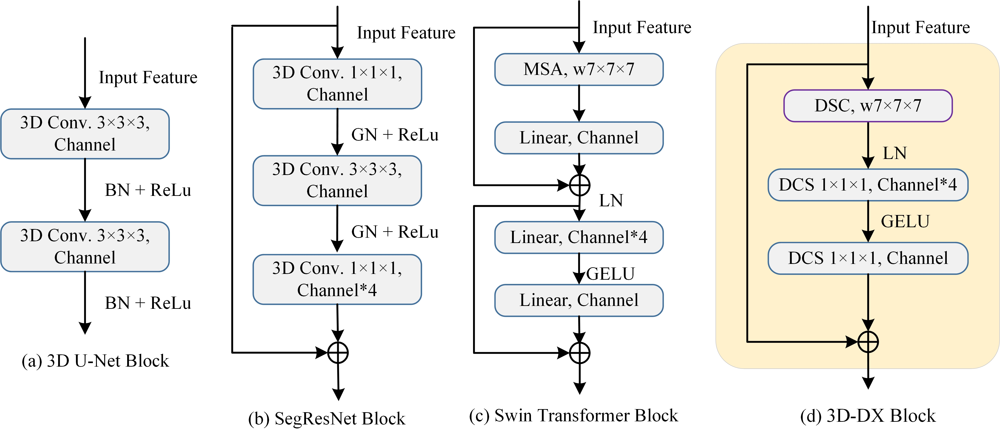
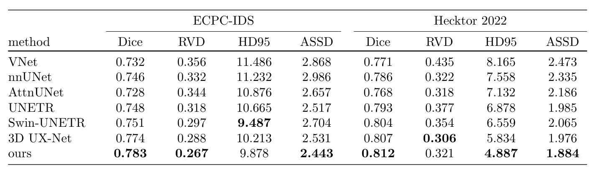
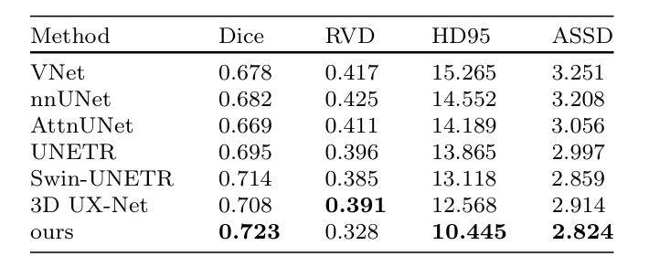

### [MA3DSeg: a lightweight network enhanced with multiscale attention-guided feature mechanism for 3D tumor segmentation in PET images](https://arxiv.org/abs/2209.15076)


---

<p align="center">

</p>

<p align="center">

</p>

 we propose multiscale attention-guided feature mechanism for 3D tumor segmentation (MA3DSeg) for accurate segmentation of tumor PET images. Specifically, we first utilize a 3D-DX block to construct a lightweight encoder to minimise the redundant information generated across channel features and reduce the model complexity. 

 ## Usage
 ### Requirements
```
pytorch 1.9.0\
torchvision 0.10.0\
prettytable\
easydict\
```

 ## Training Tutorial
 - [x] ECPC-IDS, Hecktor2022 Training Code [TRAINING.md](TRAINING.md)
 - [x] AutoPET Finetuning Code [TRAINING.md](TRAINING.md)
 
 (Feel free to post suggestions in issues of recommending latest proposed transformer network for comparison. Currently, the network folder is to put the current SOTA transformer. We can further add the recommended network in it for training.)
 
 <!-- ✅ ⬜️  -->
 
 ## Results 
 ### ECPC-IDS Trained Models (5-folds cross-validation)
###  Hecktor2022 Trained Models (5-folds cross-validation)
<p align="center">

</p>

 ### AutoPET dataset Fine-tuned Models 
<p align="center">

</p>

<!-- ✅ ⬜️  -->
## Training
Training and fine-tuning instructions are in [TRAINING.md](TRAINING.md). Pretrained model weights will be uploaded for public usage later on.

<!-- ✅ ⬜️  -->
## Evaluation
Efficient evaulation can be performed for the above three public datasets as follows:
```
python test_seg.py --root path_to_image_folder --output path_to_output \
--dataset flare --network 3DUXNET --trained_weights path_to_trained_weights \
--mode test --sw_batch_size 4 --overlap 0.7 --gpu 0 --cache_rate 0.2 \
```

## Acknowledgement
This repository is built using the [timm](https://github.com/rwightman/pytorch-image-models) library.

## License
This project is released under the MIT license. Please see the [LICENSE](LICENSE) file for more information.

## Acknowledgments
Some components of this code implementation are adopted from 3D UX-Net, Swin-UNETR and nnUNet. We sincerely appreciate for their contributions.


 
 


